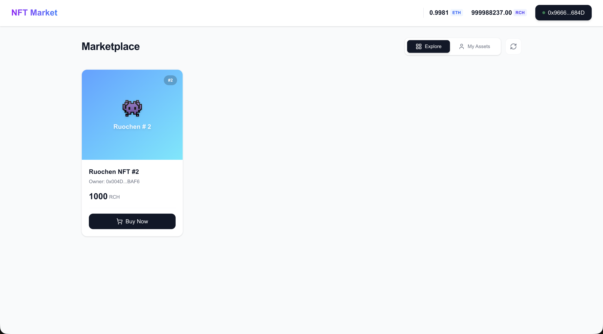

# NFT Marketplace | NFT 市场



[English](#english) | [中文](#中文)

## English

A decentralized NFT marketplace built with Next.js and Solidity, allowing users to mint, list, buy, and sell NFTs using custom ERC20 tokens.

### 🚀 Features

- **Mint NFTs**: Create unique digital assets using our custom NFT contract
- **List for Sale**: List your NFTs on the marketplace with custom pricing
- **Buy & Sell**: Purchase NFTs using RCH tokens
- **Wallet Integration**: Connect your wallet using Web3Modal (Reown AppKit)
- **Multi-chain Support**: Supports Sepolia testnet and localhost
- **Modern UI**: Clean and responsive interface built with Next.js and Tailwind CSS

### 🛠 Tech Stack

**Smart Contracts:**

- Solidity ^0.8.25
- OpenZeppelin Contracts
- Foundry for development and deployment

**Frontend:**

- Next.js 16.1.3
- React 19.2.3
- TypeScript
- Tailwind CSS
- Wagmi for Web3 integration
- Reown AppKit for wallet connections

### 📦 Project Structure

```
NFTMarket/
├── contracts/          # Smart contracts and deployment scripts
│   ├── src/            # Solidity contracts
│   ├── script/         # Deployment scripts
│   └── deployments/    # Contract addresses
└── frontend/           # Next.js frontend application
    ├── src/
    │   ├── components/ # React components
    │   ├── hooks/      # Custom React hooks
    │   └── contracts/  # Contract ABIs
    └── public/         # Static assets
```

### 🚀 Quick Start

1. **Clone the repository**

   ```bash
   git clone <repository-url>
   cd NFTMarket
   ```

2. **Install dependencies**

   ```bash
   # Install contract dependencies
   cd contracts && forge install

   # Install frontend dependencies
   cd ../frontend && pnpm install
   ```

3. **Setup environment variables**

   ```bash
   # Copy and configure environment files
   cp frontend/.env.example frontend/.env.local
   cp contracts/.env.example contracts/.env
   ```

4. **Deploy contracts (local)**

   ```bash
   cd contracts
   forge script script/DeployAll.s.sol --rpc-url http://localhost:8545 --broadcast
   ```

5. **Start the frontend**

   ```bash
   cd frontend
   pnpm dev
   ```

### 📋 Smart Contracts

- **RCH Token**: ERC20 token used for marketplace transactions
- **Ruochen NFT**: ERC721 NFT contract for minting unique tokens
- **NFT Market**: Marketplace contract for listing and trading NFTs

### 🔗 Links

- **Live Demo**: [NFT Market](https://nft.ruochen.app)
- **Contracts Documentation**: [contracts/README.md](./contracts/README.md)
- **Frontend Documentation**: [frontend/README.md](./frontend/README.md)

### 📄 License

MIT License

### 🤝 Contributing

Pull requests and issues are welcome!

---

## 中文

基于 Next.js 和 Solidity 构建的去中心化 NFT 市场，允许用户使用自定义 ERC20 代币铸造、上架、购买和出售 NFT。

### 🚀 功能特性

- **铸造 NFT**: 使用我们的自定义 NFT 合约创建独特的数字资产
- **上架销售**: 在市场上以自定义价格上架您的 NFT
- **买卖交易**: 使用 RCH 代币购买 NFT
- **钱包集成**: 使用 Web3Modal (Reown AppKit) 连接您的钱包
- **多链支持**: 支持 Sepolia 测试网和本地网络
- **现代界面**: 使用 Next.js 和 Tailwind CSS 构建的简洁响应式界面

### 🛠 技术栈

**智能合约:**

- Solidity ^0.8.25
- OpenZeppelin Contracts
- Foundry 开发和部署工具

**前端:**

- Next.js 16.1.3
- React 19.2.3
- TypeScript
- Tailwind CSS
- Wagmi Web3 集成
- Reown AppKit 钱包连接

### 📦 项目结构

```
NFTMarket/
├── contracts/          # 智能合约和部署脚本
│   ├── src/            # Solidity 合约
│   ├── script/         # 部署脚本
│   └── deployments/    # 合约地址
└── frontend/           # Next.js 前端应用
    ├── src/
    │   ├── components/ # React 组件
    │   ├── hooks/      # 自定义 React Hooks
    │   └── contracts/  # 合约 ABI
    └── public/         # 静态资源
```

### 🚀 快速开始

1. **克隆仓库**

   ```bash
   git clone <repository-url>
   cd NFTMarket
   ```

2. **安装依赖**

   ```bash
   # 安装合约依赖
   cd contracts && forge install

   # 安装前端依赖
   cd ../frontend && pnpm install
   ```

3. **配置环境变量**

   ```bash
   # 复制并配置环境文件
   cp frontend/.env.example frontend/.env.local
   cp contracts/.env.example contracts/.env
   ```

4. **部署合约 (本地)**

   ```bash
   cd contracts
   forge script script/DeployAll.s.sol --rpc-url http://localhost:8545 --broadcast
   ```

5. **启动前端**

   ```bash
   cd frontend
   pnpm dev
   ```

### 📋 智能合约

- **RCH Token**: 用于市场交易的 ERC20 代币
- **Ruochen NFT**: 用于铸造独特代币的 ERC721 NFT 合约
- **NFT Market**: 用于上架和交易 NFT 的市场合约

### 🔗 相关链接

- **在线预览**: [NFT Market](https://nft.ruochen.app)
- **合约文档**: [contracts/README.md](./contracts/README.md)
- **前端文档**: [frontend/README.md](./frontend/README.md)

### 📄 许可证

MIT License

### 🤝 贡献

欢迎提交 Pull Request 和 Issue！

---
